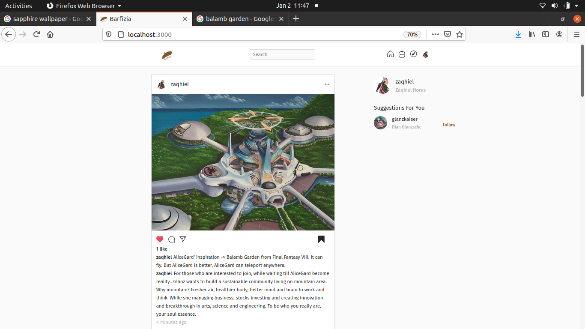
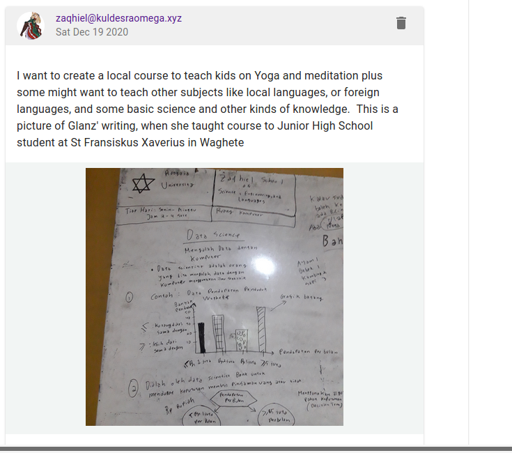
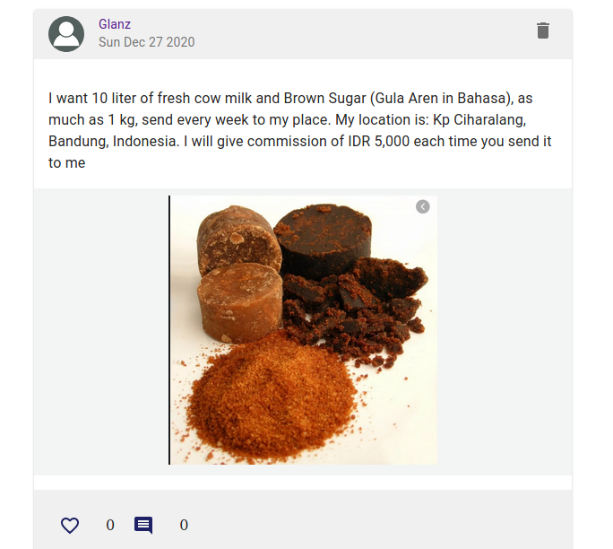
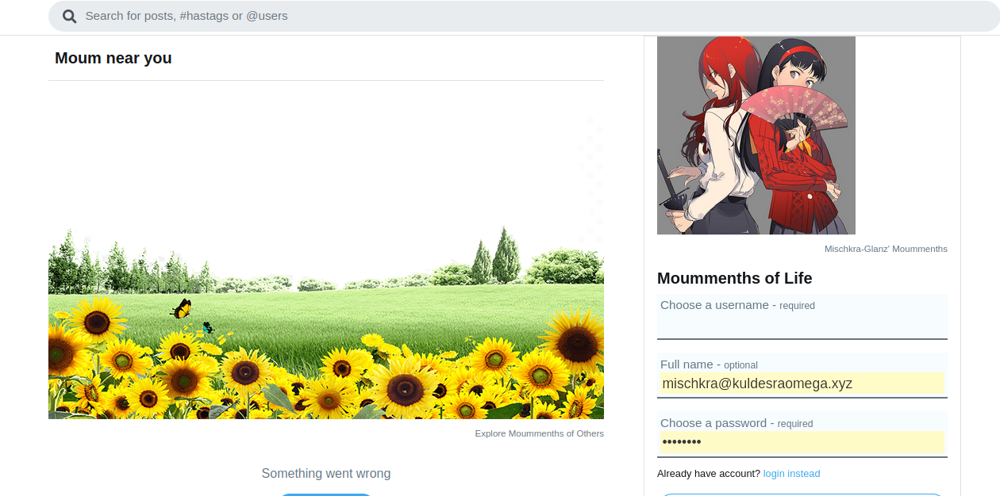
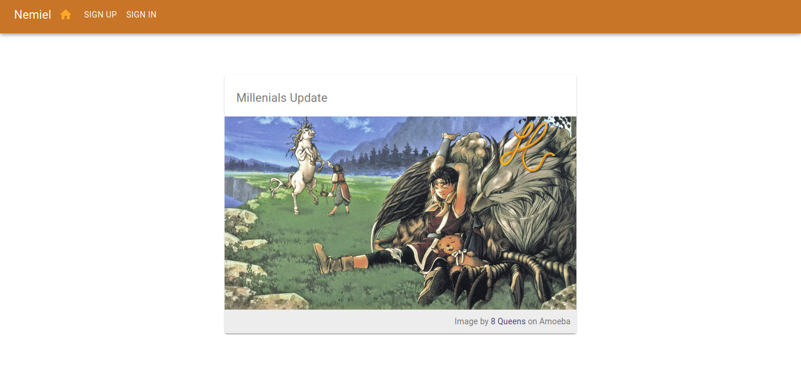
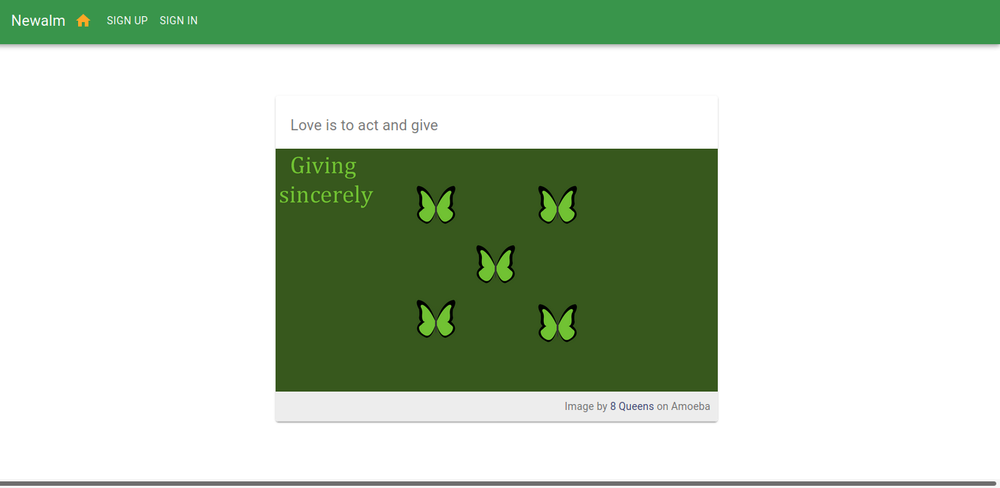
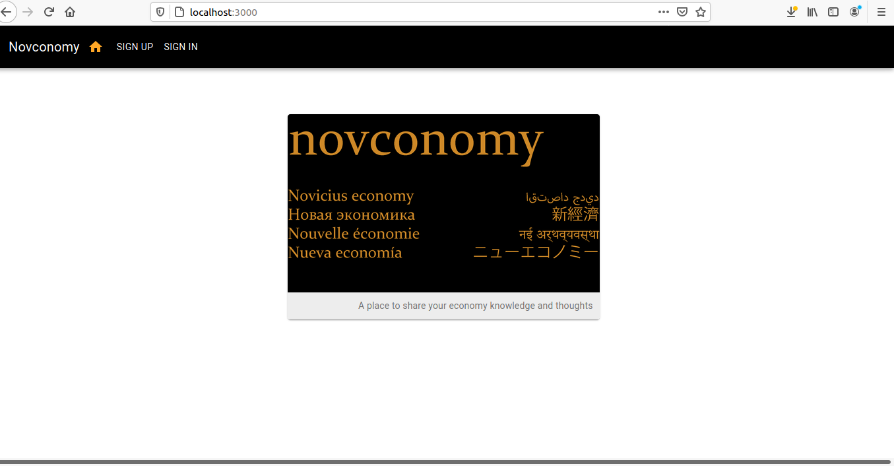
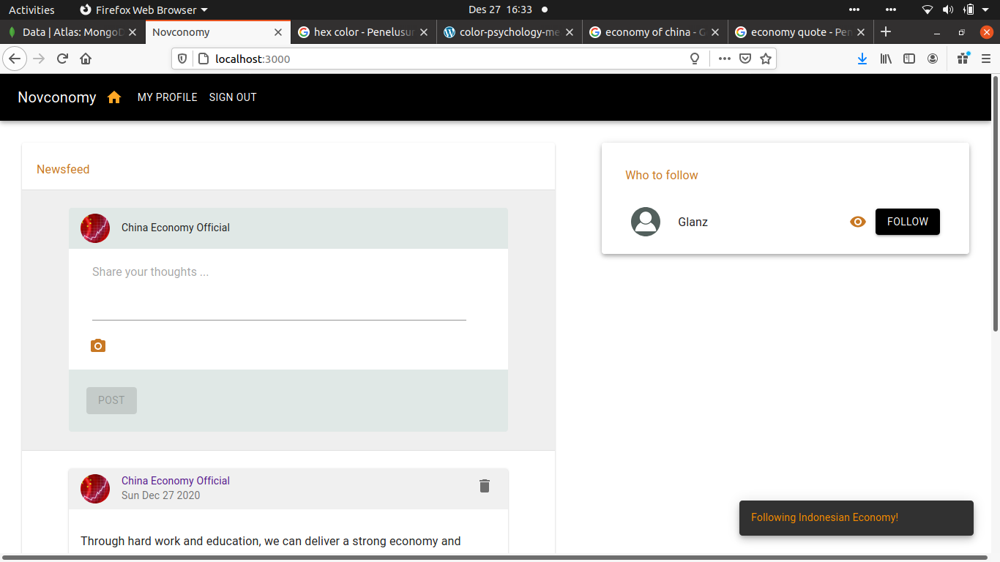
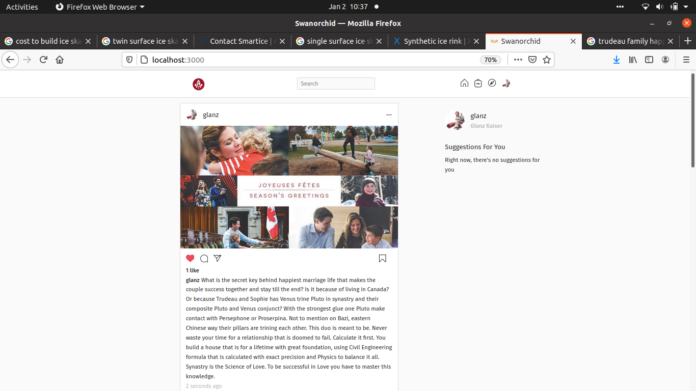
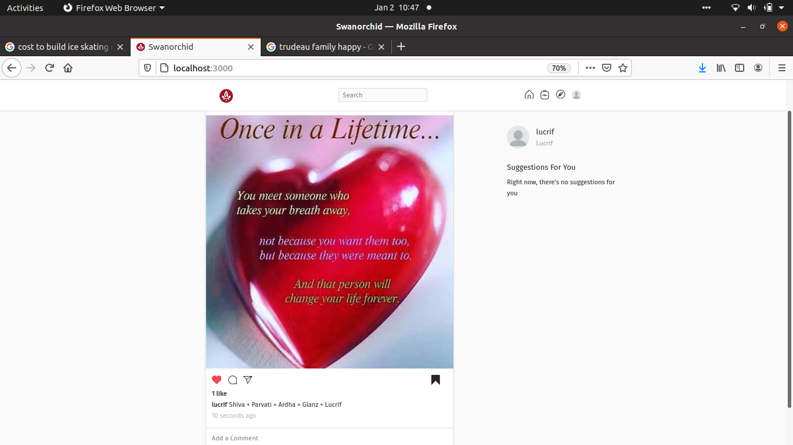

# About
Neosphere is an alias of new world, that looks like a sphere in 3-dimension geometry definition. There are:
1. Moummenths -> Social media that care not about stealing your private data nor sell it just for some ads and money
2. Consegnia -> Asking someone to buy something for you and give the reimbursement as you want
3. Biznow -> Business for XYZ generation / the business revolution of the 21st century
4. Novconomy -> Economics sharing about your local place or national country
5. Nemiel -> Sharing what you want to share with passion and love, become Star of Destiny for real without caring for fame or money.
6. Newalm -> Giving sincerely not only in money terms, I have lots of books, want to create a library at my village, but no idea how.. (this is real example)
7. Swanorchid -> Analyzing your natal birth data with the potential one, is it meant to be or only hot at the beginning? Never waste your time for the wrong person. Time is more valuable than money. You can become Gold medalist or Nobel winner instead of dating around with the wrong person.
8. Barfizia -> Inspired by Barfi movie from India, who finally find the right girl and die together as couple of broken heart. You just do what you want your destiny to become then it will be unfolded. Sharing ideas or thoughts.

#### No fees taken.. no ads... not caring for big data.. I Work for the Queendom of Goddess / Valhalla not for money. I can learn big data by myself with GFreya OS and my supercomputer made by myself. We will analyze what beneath the multiverse.

# From Mischkra
I accompany Glanz in 2021 code them all. They become nice, one day we will create the mobile apps or perhaps not if she is too busy create a sports car for Freya, who in fact does not deserve a sports car. In case you forgot, you have invented as well Mischkra website, posting very small words like junior high school wall magazine, from ... to ... contents: ...

# Barfizia

# Biznow

# Consegnia

# Moummenths

# Nemiel

# Newalm

# Novconomy

# Swanorchid

